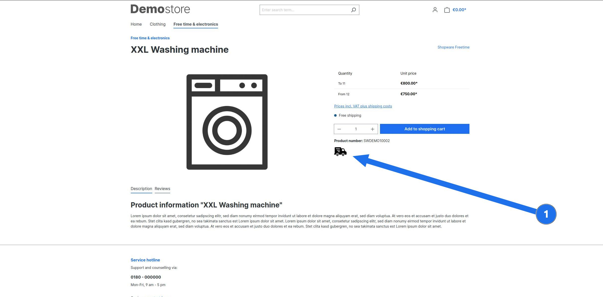

# AcademyProductCustomField

A plugin which shows how to add a `boolean` custom field to the product detail page and displays a truck image if the field is set to true.

## Features

- Add a `boolean` custom field to the product
- Show truck image on product detail page if the custom field is set to true

